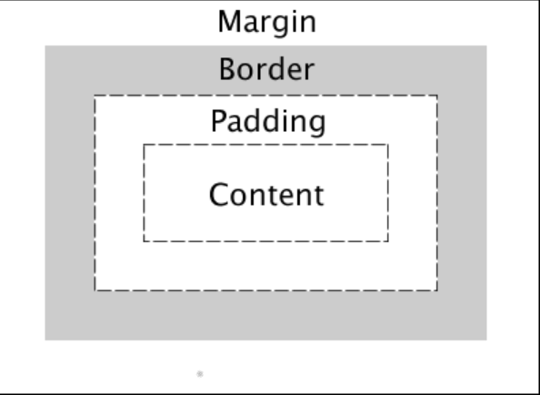

1.
Props are a means of transferring data between React components. Data flow between components in React is one-way (from parent to child only).

                class ParentComponent extends Component {    
                    render() {    
                        return (        
                            <ChildComponent name="First Child" />    
                        );  
                    }
                }
                const ChildComponent = (props) => {    
                    return 
{props.name}
; 
                };
Here, "Name" is a defined prop that holds text information. After that, we can pass data with props to functions as if they were arguments:

Components can create and manage data internally, unlike props, which cannot pass data with state.
setState( ) function allows you to update the state of a component.

                class State extends React.Component {    
                    constructor() {    
                        this.state = {      
                            id: 1,      
                            name: "state"    
                        };  
                    }    
                    
                    render() {    
                        return (      
                            
        
                            
{this.state.id}
        
                            
{this.state.name}
      
                            
    
                        );  
                    }
                }

2.
A functor is a design pattern used in functional programming that was influenced by the category theory definition and allows one to apply a function inside a generic type without changing the generic type's structure. See example in JS below

                const Functor = (v) => ({
                    value: v,
                    map: (f) => Functor(f(v))
                });

                var s =  Functor(2)
                .map(x=>x*x)
                .map(x=>x.toString());
3.
### Callbacks
One advantage of callbacks is they wait for the previous operations to be completed then only execute the next operation.
One disadvantage of callbacks is they are not composable and will continue the execution of the program when some value is ready. 
### Promises
One advantage of promises is they are composable i.e You can return a Promise from a Promise and that will chain the Promises together. 
One disadvantage of promises
### Streams
One advantage of streams is that they support for multiple observers and have the ability to control the lifetime of the subscriptions.
One disadvantage of streams is that they can only be used once. 

4.

In the above the diagram the layers of the box model can be seen.The size of each of the layers can be specified using the usual CSS units of measure em, %, and px.

                div {
                width: 200px;
                padding: 20px;
                border: 5px solid black;
                margin: 40px;
                }

The content of the box is changed by width, then padding clears an area around the content, next a border going around the padding and content of 5px. Lastly margin clears a transparent area outside the border.

5.

The user launches a browser and enters the URL. The browser sends a DNS request to the server, which replies with the IP address, in order to find the server IP address associated with the URL. The necessary files, which include html, CSS, and JS resources, are delivered after the browser sends an HTTP request. The bootstrap script is loaded after the browser has parsed the html. The dynamic content is then loaded by the bootstrap CDN, and the attached script is handled and rendered by the DOM at the end.